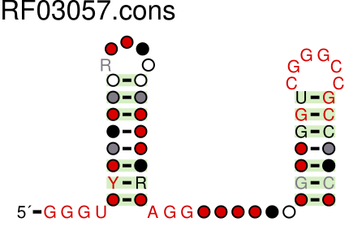
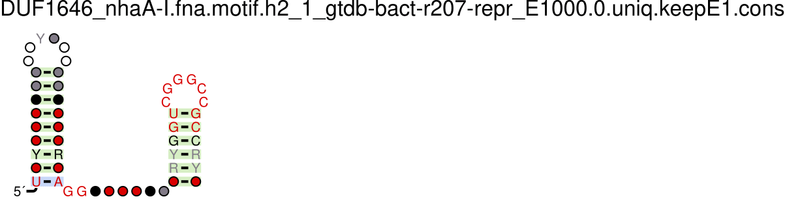

# CPSC 290 at The Breaker Lab

Project developed during Spring 2023 for CPSC 290: Directed Research in Computer Science at Yale University, under the mentorship of Dr. Ronald Breaker and Christopher King.

The project is incomplete, to be continued over the summer. The main goal of the project is to improve computational tools for structured RNA discovery and analysis. The project is divided into three parts: the first is the development of a pipeline that interfaces with numerous bioinformatic software packages, including Infernal, HMMER, CMfinder, and R2R, to perform useful operations on RNA sequence data across these tools. The second is the incorporation of a genetic algorithm into the pipeline, in place of the existing, outdated CMfinder software, to predict RNA secondary structure/folding. The final component is a frontend website that provides an interface for RNA researchers to utilize the pipeline and its various operations independently, as well as a new RALEE-esque RNA alignment editor, to conduct experiments on sequence data without needing technical knowledge of the particular software packages.

## Project Components

### 1. Backend Pipeline
A backend pipeline that provides functions to run a genome search on a given RNA model, parse the search results into a SQL database, and then filter the data for use in generating new RNA models. The pipeline is written in Python and utilizes the Infernal, HMMER, CMfinder, and R2R software packages. The pipeline is designed to be modular, so that it can be easily extended to incorporate new software packages and operations. The pipeline is also designed to be run on a remote server, so that it can be accessed by the frontend website. The pipeline is currently incomplete, but the following functions have been implemented:

- `cmbuild_submit` and `cmcalibrate_submit`: Builds and calibrates a covariance model for a given RNA sequence alignment using Infernal.
- `cmsearch_submit`: Searches a given RNA model against a given genome database using Infernal.
- `cmsearch_parse`: Parses the results of a CMsearch search into a SQLite database.
- `cmsearch_analyze`: Analyzes the results of a CMsearch search by plotting the E-value score distribution of the hits, filtering the hits by E-value score and uniqueness and reporting count numbers, and running R2R on the hits to visualize the resulting model.
- `runr2r`: Runs R2R on a given RNA model to visualize the results of a CMsearch search.
- `sto_reformat`: Reformats a given RNA sequence alignment from Stockholm to FASTA (unannotated) format.
- `run_cmfinder`: Runs CMfinder on a given RNA sequence alignment FASTA file to predict RNA secondary structure/folding.

The pipeline is currently being redesigned to utilize a SQL database instead of a filesystem + in-memory data structures to store and manipulate data. The pipeline is also being redesigned to be more modular, so that it can be easily extended to incorporate new software packages and operations. However, this means that some functionality was reversed in the process of redesigning the pipeline, and some functionality is currently missing. The following functions are currently missing:

- `cmsearch_compare`: Compares the results of two CMsearch searches to determine the number of hits that are unique to each search, and the number of hits that are shared between the two searches.

In lieu of a frontend website, the pipeline is currently accessed through a command-line interface (CLI) that provides commands for running each of the pipeline functions, or the pipeline can be run directly from the Python interpreter. The CLI is implemented using the Python Click library. It is possible to start a process that runs the entire pipeline in the background on the cluster, and then check the status of the process later.

### 2. Genetic Algorithm
A genetic algorithm that predicts RNA secondary structure/folding for a given RNA sequence alignment. The genetic algorithm is written in Python, and is meant to replace the CMfinder step of the pipeline, since CMfinder is out-of-date and uses the Perl programming language. The genetic algorithm is currently incomplete, but a prototype has been implemented, nick-named TrEAT, or Tree Evolution of Augmenting Topologies, which refers to the usage of a tree data structure to represent the context-free grammar of the RNA secondary structure/folding, and is strongly based on the famous [Neuro-Evolution of Augmenting Topologies](https://nn.cs.utexas.edu/downloads/papers/stanley.ec02.pdf) (NEAT) algorithm for evolving neural networks. The following functionality has been implemented:

- `Rule`: A class that represents a rule in the context-free grammar of the RNA secondary structure/folding. Each rule consists of a sequence that describes the primary structure of the RNA, with id's that refer to other rules in the grammar. Each rule should also have a probability of being chosen, but this functionality has not yet been implemented. The rule class also contains functions to mutate the rule, to generate a random rule, and to crossover two rules
- `Genome`: A class that represents a genome, which is a collection of 'rule' genes that encode a context-free grammer. The genome class also contains functions to mutate the genome, generate a random genome, and crossover two genomes. The crossover function is designed as in NEAT, using a historical marking scheme to align the genes of the two genomes to solve the competing conventions problem.
- `Organism`: A class that represents an organism, which is a genome that has a fitness score and belongs to a species.
- `Species`: A class that represents a species, which is a collection of organisms with similar genomes, and is used to maintain diversity in the population. Originally devised by Kenneth Stanley in the NEAT algorithm to solve the problem of protecting structural innovation in the population.
- `Population`: A class that represents a population, which is a collection of organisms and their species. The population class also contains functions to evolve the population, which is done by speciating the organisms, killing off the worst organisms in each species, and then breeding the remaining organisms in each species to generate new organisms.
- `Simulation`: A class that represents a simulation, which has a population and defines the operations of reproduction/evolution for the population. The simulation class also contains functions to run the simulation, which is done by running the reproduction/evolutionary operations for a given number of generations.

The genetic algorithm has to be adapted to fit into the pipeline once it is completed.

### 3. Frontend
A frontend website that provides an interface for RNA researchers to utilize the pipeline and its various operations independently, as well as a new RALEE-esque RNA alignment editor, to conduct experiments on sequence data without needing technical knowledge of the particular software packages. The frontend is incomplete, and is currently implemented using the Python Flask framework and HTML/CSS/JavaScript. Ideally, the frontend will be redesigned to utilize the React.js library. The following functionality has been implemented:

- User authentication and authorization using the Flask-Login library.
- Admin password protection, since we plan to host the website on a public server.
- A prototype of the RALEE-esque RNA alignment editor, which is currently implemented using a custom Stockholm file parser plus JavaScript to render the alignment. The prototype is incomplete, and does not allow for editing or saving the alignment. We plan to reprogram the Stockholm alignment parser to utilize a numpy array to represent the alignment, making column/row operations faster, and to utilize the React.js library to render the alignment for editing.

Once the pipeline is completed, the frontend will be redesigned to enable users to 1) run the pipeline operations independently, 2) run the pipeline step-by-step, and 3) run the entire pipeline, and to visualize the results of the operations. As of now, the frontend is not connected to the backend pipeline, and is only a prototype.

## Discussion
Much time spent working on the project was devoted to learning the basics of bioinformatics and computational biology, as well as the various software packages used in the project. I learned how to use the Infernal, HMMER, CMfinder, and R2R software packages, as well as the command-line interface of the Yale HPC cluster and the SLURM job scheduler to run jobs on the cluster.

Many of our regular meetings were also spent discussing the design of the pipeline, backend database, and code organization. Since I am transitioning the pipeline to SQL, the backend database is currently incomplete, and the code organization is currently in flux. However, I have learned a lot about how to design a modular, extensible, and maintainable software project.

## Results
I am conducting an experiment using my pipeline to analyze two sodium-binding RNA motifs, known as nhaA-I and DUF1646, to determine whether they can be combined into a single representative model. My experimental process is as follows:

### 1.
I downloaded the nhaA-I (RF03057) and DUF1646 (RF03071) RNA sequence alignments from the Rfam website. Shown below are R2R diagrams of the two alignments:




As shown by the diagrams, the two RNAs are very similar, each with two stem-loops. The two RNAs also have similar lengths, with nhaA-I being 95 nucleotides long, and DUF1646 being 77 nucleotides long.

### 2.
Using my pipeline, I ran CMsearch on the two alignments against a representative sample of bacterial genomes from Genome Taxonomy Database Release 207. The analyses of the results of the CMsearch searches, filtered by uniqueness and E-value threshold, are shown below:


| Search Name         | # Total  | # Unique  | # E<1   | # Unique E<1 |
|---------------------|----------|-----------|---------|--------------|
| gtdb-prok_nhaA-I_2  | 4365     | 4091      | 1796    | 1663         |
| gtdb-prok_DUF1646_1 | 1649     | 1478      | 497     | 421          |

### 3.
I reformatted the search results alignments (Stockholm files) as FASTA sequence files, and ran CMfinder on each of 1) the nhaA-I search results alignment, 2) the DUF1646 search results alignment, and 3) the combined search results alignment generated by concatenating the two FASTA files. The results of the CMfinder searches are shown below:


And my combined search results alignment:


Chris created another combined alignment using esl-alimerge on the Rfam files for nhaA-I and DUF1646, which we dubbed LiNa, shown below:


### 4.
Then, to evaluate our combined models, I ran Infernal's cmsearch once more on the combined alignment generated by CMfinder, and on the LiNa alignment. The results of the cmsearches are shown below:





| Search Name         | # Total  | # Unique  | # E<1   | # Unique E<1 |
|---------------------|----------|-----------|---------|--------------|
| DUF1646_nhaA-I.fna.motif.h2_1_gtdb-bact-r207-repr_E1000.0 | 14536 | 13398 | 1818 | 1665
| lina-combo-v1_gtdb-bact-r207-repr_E1000.0                 | 2354  | 2183  | 1953 | 1801

### 5.
Finally, I wrote a script to perform a few comparisons between the four CMsearches, since we want to see how the combined models compare to the individual models.

First, we report hit counts for each search, including the total number of hits found, the number of unique hits found, and the number of unique hits found with an E-value less than 1000.0. The results are shown below:

| Search Name                                               |   # Total |   # Unique |   # Unique E<1000 |
|-----------------------------------------------------------|-----------|------------|-------------------|
| gtdb-prok_DUF1646_1                                       |      1649 |       1478 |              1474 |
| gtdb-prok_nhaA-I_2                                        |      4365 |       4091 |              4080 |
| DUF1646_nhaA-I.fna.motif.h2_1_gtdb-bact-r207-repr_E1000.0 |     14536 |      13398 |             13355 |
| lina-combo-v1_gtdb-bact-r207-repr_E1000.0                 |      2354 |       2183 |              2181 |

Then, we check and find zero intersecting hits in the original nhaA-I and DUF1646 searches:
```
Found 0 intersecting hits between DUF1646 and nhaA-I
```

Then, for each combined model, we compare the results of the combined model to the nhaA-I and DUF1646 searches to identify true positives (TP), false positives (FP), and false negatives (FN) by the following template:

<table>
<tr><th>Template</th><th>Legend</th></tr>
<tr><td>

|    E |   I |   II |   III |   IV |   V |
|------|-----|------|-------|------|-----|
|    1 |   ? |    ? |     ? |    ? |   ? |
|   10 |   ? |    ? |     ? |    ? |   ? |
|  100 |   ? |    ? |     ? |    ? |   ? |
| 1000 |   ? |    ? |     ? |    ? |   ? |

</td><td>

| Name | Description                              | Meaning |
|------|------------------------------------------| ------- |
|    E | E-value threshold                        |         |
|    I | # of DUF1646 hits not in combo           | FN      |
|   II | # of DUF1646 hits in combo               | TP      |
|  III | # of combo hits not in DUF1646 or nhaA-I | FP?     | 
|   IV | # of nhaA-I hits in combo                | TP      |
|    V | # of nhaA-I hits not in combo            | FN      |

</td></tr>
</table>

Note: Some of the false positives in III may actually be true positives. For example, if a hit is found in the combined model, but not in either of the individual models, it could be a true positive that was missed by the individual models, or it could be a false positive that was found by the combined model. We can't tell without further analysis.

The results of the comparisons are shown below:

#### Comparison of DUF1646_nhaA-I combined model search results to DUF1646 and nhaA-I searches:

|    E |   I |   II |   III |   IV |   V |
|------|-----|------|-------|------|-----|
| 1000 | 421 |    0 | 11698 | 1657 |   6 |
|  100 | 421 |    0 |  2768 | 1653 |  10 |
|   10 | 421 |    0 |   577 | 1631 |  32 |
|    1 | 421 |    0 |   110 | 1555 | 108 |

From this table we can see that my combined model overfits to nhaA-I and completely misses hits from DUF1646. This is likely due to an issue with CMfinder; since nhaA-I has so many hits, it is likely that CMfinder finds the pattern in nhaA-I and then stops looking for it in DUF1646. This is a problem that I will need to address in the future. However, we can see that the combined model does find some hits that are not found by either of the individual models, so it still may be useful. Future work will include further analysis of these hits, described in the next section.

We also report any instances of tandems, which we define as hits that are located within 100 bp of each other. This information is not useful to our current analysis, but could be an interesting case study and demonstrates the pipeline's breadth of functionality. The results are shown below:

```
Found tandem: MGTI01000074.1 11757-11703 11641-11590
Found tandem: MGTI01000074.1 11644-11589 11754-11704
Found tandem: MVRP01000073.1 1364-1414 1506-1555
Found tandem: MVRP01000073.1 1503-1556 1367-1414
Found tandem: JADJGV010000011.1 59728-59776 59633-59588
Found tandem: JADJGV010000011.1 59636-59587 59731-59775
Found tandem: VGRU01000033.1 489-431 351-297
Found tandem: VGRU01000033.1 354-296 486-432
Found tandem: QZJR01000105.1 17578-17640 17438-17496
Found tandem: DCVI01000207.1 44770-44713 44918-44868
Found tandem: VGSH01000014.1 30017-29962 30160-30109
Found tandem: VGSH01000014.1 30017-29962 29868-29814
Found tandem: VGSH01000014.1 30163-30108 30014-29963
Found tandem: VGSH01000014.1 29871-29813 30014-29963
Found tandem: MVRP01000001.1 47864-47916 47997-48051
Found tandem: MVRP01000001.1 47994-48052 47867-47915
Found tandem: MVRP01000044.1 25032-24978 25166-25119
Found tandem: MVRP01000044.1 25169-25119 25029-24979
Found tandem: MGTI01000074.1 11757-11703 11641-11590
Found tandem: MGTI01000074.1 11644-11589 11754-11704
Found tandem: MVRP01000073.1 1364-1414 1506-1555
Found tandem: MVRP01000073.1 1503-1556 1367-1414
Found tandem: JADJGV010000011.1 59728-59776 59633-59588
Found tandem: JADJGV010000011.1 59636-59587 59731-59775
Found tandem: VGRU01000033.1 489-431 351-297
Found tandem: VGRU01000033.1 354-296 486-432
Found tandem: DCVI01000207.1 44770-44713 44918-44868
Found tandem: VGSH01000014.1 30017-29962 30160-30109
Found tandem: VGSH01000014.1 30017-29962 29868-29814
Found tandem: VGSH01000014.1 30163-30108 30014-29963
Found tandem: VGSH01000014.1 29871-29813 30014-29963
Found tandem: MVRP01000001.1 47864-47916 47997-48051
Found tandem: MVRP01000001.1 47994-48052 47867-47915
Found tandem: MVRP01000044.1 25032-24978 25166-25119
Found tandem: MVRP01000044.1 25169-25119 25029-24979
Found tandem: MGTI01000074.1 11757-11703 11641-11590
Found tandem: MGTI01000074.1 11644-11589 11754-11704
Found tandem: MVRP01000073.1 1364-1414 1506-1555
Found tandem: MVRP01000073.1 1503-1556 1367-1414
Found tandem: JADJGV010000011.1 59728-59776 59633-59588
Found tandem: JADJGV010000011.1 59636-59587 59731-59775
Found tandem: VGRU01000033.1 489-431 351-297
Found tandem: VGRU01000033.1 354-296 486-432
Found tandem: DCVI01000207.1 44770-44713 44918-44868
Found tandem: VGSH01000014.1 30017-29962 30160-30109
Found tandem: VGSH01000014.1 30017-29962 29868-29814
Found tandem: VGSH01000014.1 30163-30108 30014-29963
Found tandem: VGSH01000014.1 29871-29813 30014-29963
Found tandem: MVRP01000001.1 47864-47916 47997-48051
Found tandem: MVRP01000001.1 47994-48052 47867-47915
Found tandem: MVRP01000044.1 25032-24978 25166-25119
Found tandem: MVRP01000044.1 25169-25119 25029-24979
Found tandem: MGTI01000074.1 11757-11703 11641-11590
Found tandem: MGTI01000074.1 11644-11589 11754-11704
Found tandem: MVRP01000073.1 1364-1414 1506-1555
Found tandem: MVRP01000073.1 1503-1556 1367-1414
Found tandem: JADJGV010000011.1 59728-59776 59633-59588
Found tandem: JADJGV010000011.1 59636-59587 59731-59775
Found tandem: VGRU01000033.1 489-431 351-297
Found tandem: VGRU01000033.1 354-296 486-432
Found tandem: DCVI01000207.1 44770-44713 44918-44868
Found tandem: VGSH01000014.1 30017-29962 30160-30109
Found tandem: VGSH01000014.1 30017-29962 29868-29814
Found tandem: VGSH01000014.1 30163-30108 30014-29963
Found tandem: VGSH01000014.1 29871-29813 30014-29963
Found tandem: MVRP01000001.1 47864-47916 47997-48051
Found tandem: MVRP01000001.1 47994-48052 47867-47915
Found tandem: MVRP01000044.1 25032-24978 25166-25119
Found tandem: MVRP01000044.1 25169-25119 25029-24979
```

#### Comparison of LiNa combined model search results to DUF1646 and nhaA-I searches:

|    E |   I |   II |   III |   IV |   V |
|------|-----|------|-------|------|-----|
| 1000 | 257 |  164 |   399 | 1618 |  45 |
|  100 | 278 |  143 |    82 | 1576 |  87 |
|   10 | 325 |   96 |    25 | 1388 | 275 |
|    1 | 395 |   26 |    14 |  990 | 673 |

From this table we find that the trivially combined 

And tandems:

```
Found tandem: MGTI01000074.1 11757-11703 11644-11589
Found tandem: MGTI01000074.1 11644-11589 11757-11703
Found tandem: DHQV01000099.1 4515-4574 4379-4429
Found tandem: MVRP01000073.1 1364-1414 1503-1556
Found tandem: MVRP01000073.1 1503-1556 1364-1414
Found tandem: JADJGV010000011.1 59728-59776 59636-59587
Found tandem: JADJGV010000011.1 59636-59587 59728-59776
Found tandem: VGRU01000033.1 489-431 354-296
Found tandem: VGRU01000033.1 354-296 489-431
Found tandem: MVRS01000109.1 9551-9494 9694-9633
Found tandem: DCVI01000207.1 44921-44868 44770-44713
Found tandem: DCVI01000207.1 44770-44713 44921-44868
Found tandem: VGSH01000014.1 30017-29962 30163-30108
Found tandem: VGSH01000014.1 30017-29962 29871-29813
Found tandem: VGSH01000014.1 30163-30108 30017-29962
Found tandem: VGSH01000014.1 29871-29813 30017-29962
Found tandem: MVRP01000001.1 47864-47916 47994-48052
Found tandem: MVRP01000001.1 47994-48052 47864-47916
Found tandem: MVRP01000044.1 25032-24978 25169-25119
Found tandem: MVRP01000044.1 25169-25119 25032-24978
Found tandem: MGTI01000074.1 11757-11703 11644-11589
Found tandem: MGTI01000074.1 11644-11589 11757-11703
Found tandem: DHQV01000099.1 4515-4574 4379-4429
Found tandem: MVRP01000073.1 1364-1414 1503-1556
Found tandem: MVRP01000073.1 1503-1556 1364-1414
Found tandem: JADJGV010000011.1 59728-59776 59636-59587
Found tandem: JADJGV010000011.1 59636-59587 59728-59776
Found tandem: VGRU01000033.1 489-431 354-296
Found tandem: VGRU01000033.1 354-296 489-431
Found tandem: MVRS01000109.1 9551-9494 9694-9633
Found tandem: DCVI01000207.1 44921-44868 44770-44713
Found tandem: DCVI01000207.1 44770-44713 44921-44868
Found tandem: VGSH01000014.1 30017-29962 30163-30108
Found tandem: VGSH01000014.1 30017-29962 29871-29813
Found tandem: VGSH01000014.1 30163-30108 30017-29962
Found tandem: VGSH01000014.1 29871-29813 30017-29962
Found tandem: MVRP01000001.1 47864-47916 47994-48052
Found tandem: MVRP01000001.1 47994-48052 47864-47916
Found tandem: MVRP01000044.1 25032-24978 25169-25119
Found tandem: MVRP01000044.1 25169-25119 25032-24978
Found tandem: MGTI01000074.1 11757-11703 11644-11589
Found tandem: MGTI01000074.1 11644-11589 11757-11703
Found tandem: DHQV01000099.1 4515-4574 4379-4429
Found tandem: MVRP01000073.1 1503-1556 1364-1414
Found tandem: JADJGV010000011.1 59728-59776 59636-59587
Found tandem: JADJGV010000011.1 59636-59587 59728-59776
Found tandem: VGRU01000033.1 489-431 354-296
Found tandem: VGRU01000033.1 354-296 489-431
Found tandem: DCVI01000207.1 44921-44868 44770-44713
Found tandem: DCVI01000207.1 44770-44713 44921-44868
Found tandem: VGSH01000014.1 30017-29962 30163-30108
Found tandem: VGSH01000014.1 30017-29962 29871-29813
Found tandem: VGSH01000014.1 30163-30108 30017-29962
Found tandem: VGSH01000014.1 29871-29813 30017-29962
Found tandem: MVRP01000001.1 47864-47916 47994-48052
Found tandem: MVRP01000001.1 47994-48052 47864-47916
Found tandem: MVRP01000044.1 25032-24978 25169-25119
Found tandem: MVRP01000044.1 25169-25119 25032-24978
Found tandem: MGTI01000074.1 11757-11703 11644-11589
Found tandem: MGTI01000074.1 11644-11589 11757-11703
Found tandem: DHQV01000099.1 4515-4574 4379-4429
Found tandem: VGSH01000014.1 30017-29962 30163-30108
Found tandem: VGSH01000014.1 30017-29962 29871-29813
Found tandem: VGSH01000014.1 30163-30108 30017-29962
Found tandem: VGSH01000014.1 29871-29813 30017-29962
Found tandem: JADJGV010000011.1 59636-59587 59728-59776
Found tandem: VGRU01000033.1 489-431 354-296
Found tandem: VGRU01000033.1 354-296 489-431
Found tandem: DCVI01000207.1 44921-44868 44770-44713
Found tandem: DCVI01000207.1 44770-44713 44921-44868
```


## Future Work
There are some steps to the pipeline that have not yet been implemented, but are planned for the future. These include:
- [ ] Completing the transition to SQL and implementing a new `cmsearch_compare` method to compare two searches using SQL queries to identify duplicate/overlapping hits and tandem repeats in the outputs of `infernal` searches.
- [ ] A function to map the hits of a `cmsearch` search onto the phylogenetic tree contained in the Genome Taxonomy Database (GTDB) using R or Python to read the GTDB taxonomy tree and the Infernal output files, and then render a new file with the hits mapped onto the tree. This will enable us to view the distribution of hits across the tree and determine if there are any patterns in the distribution of hits that may be useful for identifying new riboswitches. For example, if a particular riboswitch is found in a particular clade of bacteria, it may be possible to use this information to identify new instances of the riboswitch in other, closely related bacteria. Or, if two riboswitches, such as nhaA-I and DUF1646, are found in the same clade of bacteria, this may indicate that the two riboswitches have common ancestry and can be combined into a single model. This is one method of determining whether a "false positive" hit from the combined search is actually a true positive that was missed by the original models, and therefore should be added to the model.
- [ ] A function to access genetic context for a sequence of interest from the GTDB FASTA file and render a visualization of the genetic context of the sequence of interest. This will enable us to view gene associations of a given sequence, such as a cmsearch hit, and determine if the sequence is associated with a particular gene or gene cluster, which can tell us valuable information. For example, if a hit is upstream of a gene that is annotated as a transporter (e.g. a sodium ion transporter), it is likely that the sequence is a riboswitch that regulates the expression of that transporter gene. This is another method of determining whether a "false positive" hit from the combined search is actually a true positive that was missed by the original models, and therefore should be added to the model.

In addition to these planned features, I plan to use the pipeline to update the Breaker Lab's collection of riboswitches. The Breaker Lab has a roster of ~50 riboswitches that have been identified in bacteria and eukaryotes, but have not been updated for a number of years. I am planning to utilize the pipeline to update the nhaA-I and DUF1646 motifs and other riboswitches using data from new eukaryote and bacterial genome databases, in order to identify more instances of these and other RNAs within the tree of life.

## Conclusion

I hope to create a platform to facilitate and democratize biological sequence-based research by automating key processes that currently require installing and running command-line tools and working with filesystems manually.

Over the semester of CPSC 290, I've made a lot of progress on the project, but there is still a lot to be done before the pipeline is ready for use by the Breaker Lab. I plan to continue working on the project over the summer, and I hope to have a working prototype of the pipeline by the end of the summer. I will continue my experiments on sodium-binding riboswitches with the pipeline over the summer as well, and I hope to have some interesting results to share by the end of the summer.

## Acknowledgements
I would like to thank my mentor, Chris, for his guidance and support throughout the summer. I would also like to thank the Breaker Lab for giving me the opportunity to work on this project, and the Yale Center for Research Computing for providing me with access to the HPC cluster.
